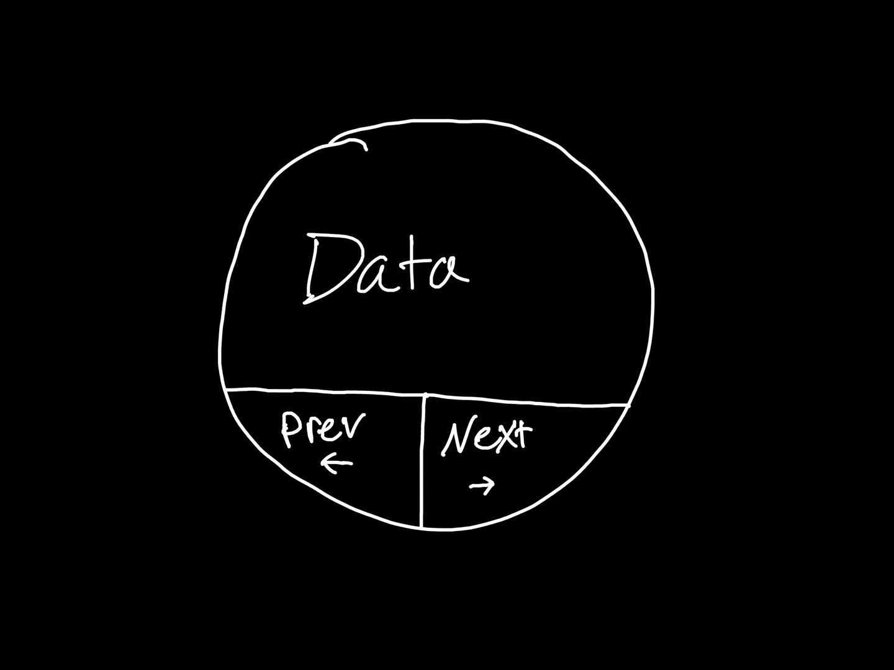

# Linked List

## What is it?
A linked list is a data structure that works by having individual "Nodes" point to the "next" piece of data (and the previous piece of data if it's a doubly-linked list). Instead of having a set "index" like an array would, the nodes essentially just float around in space, making it quite efficient to access a particular node, if you know where it is. 

## Why do we care?
If you are building an application that needs to store data, a linked list can be very efficient memory-wise in certain situations. Linked lists only allocate memory for elements that are actually present. Adding or deleting nodes is generally a fast operation, as you only have to change the surrounding nodes' "pointers" instead of shifting elements around. They are efficient for large lists, with insertions or deletions remaining a constant-time operation - the same operations on arrays can become cumbersome with large lists.

Take a big array for example - if you wanted to insert data in the middle of the list, each piece of data that is already in the list has to get moved, as their index positions have to remain accurate. Linked lists don't have this limitation.

## What are some real-world applications of linked lists?
Web browser history, e-commerce shopping cart, messaging applications, transportation reservation systems - things of that nature are all good candidates for linked lists. Even something like a photo carousel slide-show could be a good use-case.

It is worth mentioning that this is a versatile data structure. Utilizing linked lists, we can make "stacks" and "queues" - another type of data structure pattern. 

---

## What does a Node look like?
First things first, we gotta take a look at what a Node looks like.



Again, this is a doubly-linked list. It has a section for data, and also previous and next pointers. Linked lists depend entirely on these pointers, and cannot function without them. Here's how we would scaffold a node in Python:

```
class ListNode:
  def __init__(self, val):
    self.val = val
    self.prev = None
    self.next = None
```

This way, we've created a skeleton for a node that has three critical properties - the actual data, what came directly before it, and what comes immediately after it.

## What does a Linked List look like?

Let's break this down into two pieces - the initial scaffold of a linked list, and the basic methods we'd want to be able to perform with one.

### Scaffold

```
class LinkedList:
  def __init__(self):
    self.left = ListNode(0)
    self.right = ListNode(0)
    self.left.next = self.right
    self.right.prev = self.left
```

Now, why have we done it like this? Well, what those left and right nodes are, are essentially dummy nodes! What they allow us to do, is more easily traverse, insert, and delete nodes, as they essentially act like placeholders, and we always know where these placeholders are. We won't ever do any actual actions on them, they're essentially helpers for us. While the self.right.prev and self.left.next pointers will change over time as we use the linked list, the actual self.left and self.right properties won't ever actually change.

### Methods

There are 5 essential methods we're going to want for our linked list:

* getAtIndex
* addAtIndex
* deleteAtIndex
* addAtHead
* addAtTail

And I'm throwing in a bonus one just because I liked being able to see all the data for testing purposes:

* printAll

### getAtIndex

```
def getAtIndex(self, index: int) -> int:
  cur = self.left.next
  while cur and index > 0:
    cur = cur.next
    index -= 1
  if cur and cur != self.right and index == 0:
    return cur.val
  return -1
```
* While our cur node has a value, and we haven't hit our ending dummy node, move to the next node.
* We instantiate a var so we can traverse the list - set it to our first node with actual data, next to our dummy node.
* By decrementing index each time, it will hit 0 once we've arrived at the right node.
* Cur has a value, we haven't hit our ending dummy node, and index is 0, we know we've arrived.
* If all else fails, we know the index isn't there and we return -1 instead.

### addAtIndex

```
def addAtIndex(self, index: int, val: int) -> int:
  cur = self.left.next
        while cur and index > 0:
            cur = cur.next
            index -= 1
        if cur and index == 0:
            node, next, prev = ListNode(val), cur, cur.prev
            prev.next = node
            next.prev = node
            node.next = next
            node.prev = prev
```
* 3 vars, the new node (with value), next saves the current node, prev saves the previous node
* Set prev node's next pointer to our new node
* Set next node's prev pointer to our new node - now both surrounding nodes point to the correct spot
* Set our new node's next pointer to the next node (we can do this because we saved the reference earlier)
* Same thing - set our new node's previous pointer to the previous node

### deleteAtIndex

```
  def deleteAtIndex(self, index: int) -> None:
      cur = self.left.next
      while cur and index > 0:
          cur = cur.next
          index -= 1
      if cur and cur != cur.next and index == 0:
          next, prev = cur.next, cur.prev
          next.prev = prev
          prev.next = next
```
* We need all 3 conditions so that we don't accidentally go "out of bounds to the last node"
* Save the references for the next and previous node
* Change pointer of next to point to the previous node
* Change pointer of previous node's next pointer to the next node

### addAtHead and addAtTail

```
  def addAtHead(self, val: int) -> None:
      node, next, prev = ListNode(val), self.left.next, self.left
      prev.next = node
      next.prev = node
      node.next = next
      node.prev = prev

  def addAtTail(self, val: int) -> None:
      node, next, prev = ListNode(val), self.right, self.right.prev
      next.prev = node
      prev.next = node
      node.next = next
      node.prev = prev
```

### optional printAll

```
  def printAll(self) -> None:
      cur = self.left.next
      while cur and cur != self.right:
          print(cur.val)
          cur = cur.next
```

---

## Summary

It's been weird for me to learn linked lists, because they just haven't clicked for me in the past. I'm not sure exactly why, but I was always confused how people thought they were so easy/are sometimes considered the easiest data structure. What's helped is simply remembering that tt really comes down to ensuring you're using the correct order of the operations - instantiate your new data, find where you want to put it, save the references of the next and previous node locations, set your saved references to your new node (breaking their previous connection), and then set your new node to point to those references. It's a lot of back-and-forth with very similar variable names, and you need a while loop in order to make traversal work. But the more you look at it, the easier it gets.